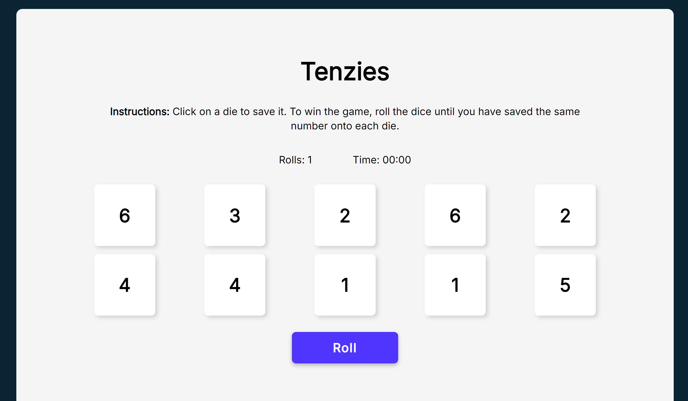

# Tenzies 
### Link
https://rosachen3-tenzies.netlify.app/

### 🎲 How to Play The Game 
Select any die to save it. To win, ensure all dice display the same number. Click 'Roll' to refresh the dice.

### 🛠️ Build
This game was built using:
* HTML
* CSS
* JavaScript
* ReactJS

This project was created to learn the fundamentals of ReactJS, including conditional rendering and the use of hooks for managing state and side effects.
